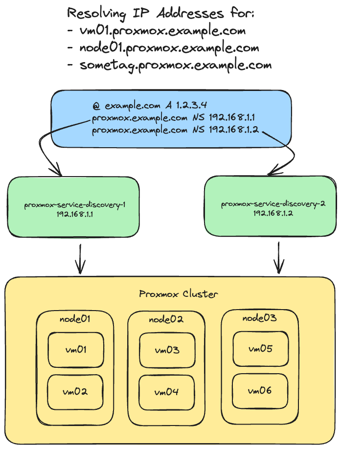

# Proxmox Service Discovery

This project implements a DNS-based service discovery mechanism using Go for Proxmox Cluster. The service retrieves virtual machine (VM) information from a Proxmox API and automatically generates DNS `A` records based on VM names and tags. These records are updated periodically and can be used to discover services in a dynamic environment.



## Features

- Retrieves VM information (name, tags, IP) from the Proxmox API.
- Dynamically generates DNS `A` records based on VM names and tags.
- Updates DNS records every minute, ensuring the latest VM state.
- Uses a custom DNS suffix for generated records.
- Supports service discovery by allowing other services to resolve VMs by name or tag using DNS.

## How It Works

1. The service queries the Proxmox API to fetch a list of VMs for each node.
2. For each VM, the service retrieves the VM's configuration, including:
   - Node name and IP Address (`DISCOVERY_NODE_CIDR`)
   - VM name (`name`) and IP address (`ipconfig0`)
   - VM tags (`tags`), which are separated by semicolons. (`DISCOVERY_VM_TAGS`)
3. The service creates DNS `A` records for each Node in Cluster and VM based on its name and tags, appending a configurable DNS suffix to each record.
4. These records are updated in memory every 60 seconds to reflect changes in the Proxmox environment.
5. The service runs a DNS server on port `2053` that resolves DNS queries based on the stored records.

## Requirements

- Go 1.18+
- A running Proxmox instance with API access

## Installation

1. Clone the repository:

    ```sh
    git clone https://github.com/nrukavkov/proxmox-service-discovery.git
    cd proxmox-service-discovery
    ```
2. Install dependencies:

    ```sh
    go mod tidy
    ```
3. Create a .env file to configure the service:

    ```sh
    touch .env
    ```

4. In the .env file, add the following environment variables:

    ```
    PROXMOX_URL=https://your-proxmox-api-url
    PVE_API_TOKEN=your-proxmox-api-token
    DNS_SUFFIX=.proxmox.example.com
    DNS_LISTEN_PORT=53 # use 2053 for local testing
    DNS_REFRESH_SECONDS=60 # how ofter go to proxmox api
    DISCOVERY_VM_TAGS=true # if true proxmox-service-discovery records will be filled also with tags
    DISCOVERY_NODE_CIDR=192.168.0.0/24
    ```

5. Build and run the Go application:

    ```sh
    go build -o proxmox-service-discovery
    ./proxmox-service-discovery
    ```

The DNS server will start on port 2053 and will update DNS records every minute.

To test the DNS queries, you can use dig or any other DNS client:

```sh
dig @localhost -p 2053 vm01.proxmox.example.com
```

## License

This project is licensed under the MIT License. See the LICENSE file for details.